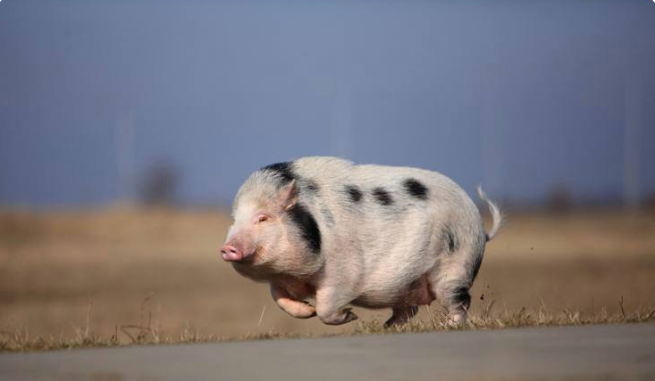

## A centered still figure



## An interactive table

```{r}
library(DT)

penguins |>
  datatable(options = list(pageLength = 20))
```

## A moving figure

In Honour of Hyves returning, as seen on the news, it seemed only fitting to use the dancing banana as my choice for a moving image.


## A two column slide

```{r}
#| output-location: column 
#| echo: true
library(ggplot2)

ggplot(penguins,
       aes(x = flipper_len, y = body_mass,
           color = island, shape = sex)) +
  geom_point()

```

## An aligned multi-row equation

$$
\begin{align}
y &= 2x - 6 \\
  &= 2(4) - 6 \\
  &= 8 - 6 \\
  &= 2
\end{align}
$$

## A citation and reference list

I had to read a paper written by Rao [@rao2020] for a EMOS course. I had to present chapter 8. The paper of Kitchen [@kitchin2015] was also part of my EMOS course. It was very informative and nice to read.

## A bibliographic reference

As a bibliographic reference i used the article written by Tibshirani. I added it by using the nocite command, but i did not actually use it as a in-text citation. I hope this was the question.

## R code, displayed but not executed

```{r}
#| echo: true
#| eval: false

table(penguins$sex, penguins$island)
```

## R code that is executed, but not displayd

```{r}
#| label: Penguins graph
#| cache: true
#| echo: false
#| eval: true

ggplot(data = penguins, aes(x = flipper_len, y = body_mass, colour = bill_dep)) +
  geom_point()
```

Here is a scatter plot of penguin flipper length vs. body mass, colored by their bill length. I learned that a bill is their beak.


## Literature {#references .unnumbered}
